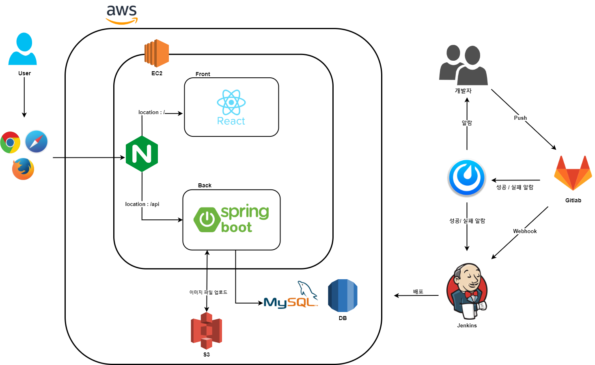

# 주니어 개발자들을 위한 포트폴리오 제작 플랫폼

> 주니어 개발자들을 위한 포트폴리오 제작 플랫폼
>
> 참고 : 미리캔버스,  Wix 

#### 🔨Built With

⭐ **Front-end** :     

⭐ **Back-end** :   

⭐ **CI / CD** :   

#### 🧩 주요 기능

**SignIn**

- github, google을 통한 간편 로그인 (회원가입)

**Profile**

- 닉네임, 프로필 이미지 등 (회원 정보 조회 및 수정 기능)

**Portfolio Editor** 

- 포트폴리오 편집 툴 기능
- 포트폴리오 pdf 추출 기능
- 포트폴리오 웹 페이지 구성 및 제작 기능

**Portfolio Page**

- url 기반으 웹 포트폴리오 페이지 조회 기능

**Portfolio Template** 

- 기술 스택 별 포트폴리오 템플릿 필터링 기능
- 포트폴리오 찜 기능
- 찜한 포트폴리오 조회 기능

#### 👨‍👩‍👧‍👧 팀원 소개

|     Name     |  명도균  |  김민혁  |  류건희  |  유진우  |  전의수  |
| :----------: | :------: | :------: | :------: | :------: | :------: |
| **Profile**  |   사진   |   사진   |   사진   |   사진   |   사진   |
|   **R&R**    | **팀장** | **팀원** | **팀원** | **팀원** | **팀원** |
|   **Git**    |    깃    |    깃    |    깃    |    깃    |    깃    |
| **Position** |  포지션  |  포지션  |  포지션  |  포지션  |  포지션  |

