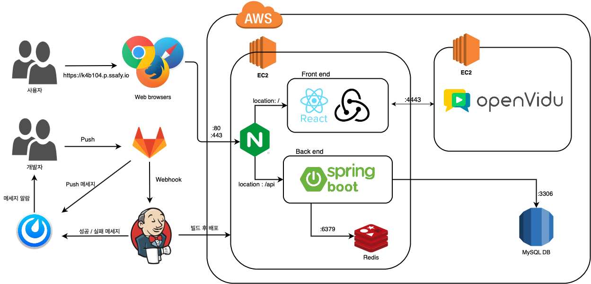
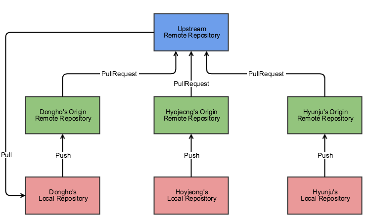
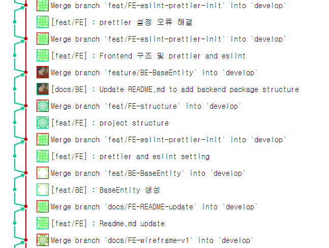
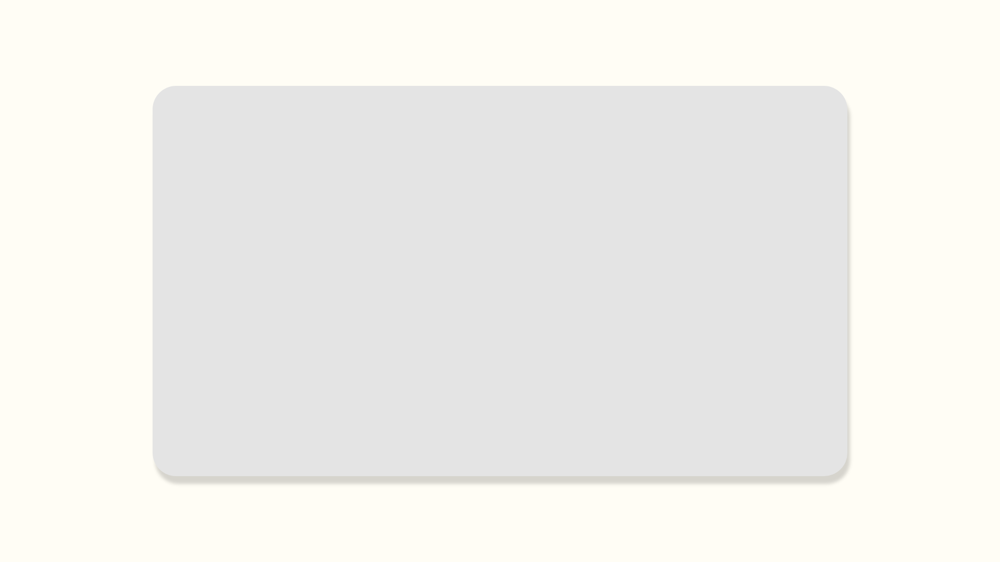
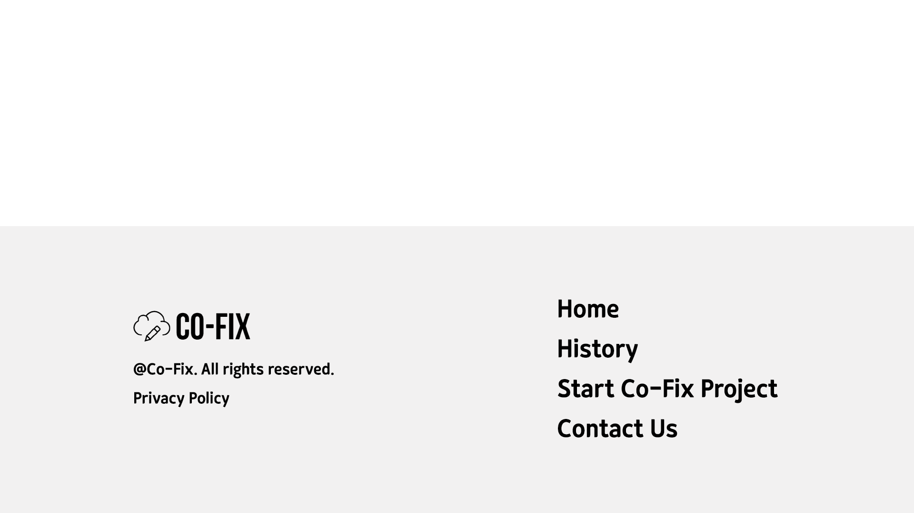

> 실시간 온라인 공동 첨삭 플랫폼

#### 🔨Built With

⭐ **Front-end** :      

⭐ **Back-end** :      

⭐ **CI / CD** :     

#### 🧩 주요 기능

**SignIn**

- github, google을 통한 간편 로그인 (회원가입)

**Co-Fix**

- 실시간 글에 대한 comment
- Comment에 대한 agree 기능
- 문장에 대한 평가 기능 ( Fix 고쳐야할 부분 )
- 문장 직접 수정 기능
- Pin-Code 복사 기능
- 음성 및 화상 통화기능
- 복사 (ctrl + c 및 html ) 방지

**Create Co-Fix**

- 제목 입력
- 인원 설정
- 첨삭 텍스트 입력

**Join Co-Fix**

- 저작권 및 서비스 이용 안내
- Pincode 입력

**History**

- 이제까지 첨삭한 pjt 목록 조회
- 상세 결과 페이지로 이동

**History Detail**

- co-fix 결과 화면
- 첨삭이 필요한 문장 표시
- 고쳐야 하는 문장 표시
- 원본, 수정본 비교기능
- 각 문장 마다 comment 모아서 한 번에 볼 수 있는 기능

#### 👨‍👩‍👧‍👧 팀원 소개

|     Name     |                                                                      명도균                                                                      |                                                                     김민혁                                                                      |                                                                     류건희                                                                      |                                                                      유진우                                                                      |                                                                     전의수                                                                      |
| :----------: | :----------------------------------------------------------------------------------------------------------------------------------------------: | :---------------------------------------------------------------------------------------------------------------------------------------------: | :---------------------------------------------------------------------------------------------------------------------------------------------: | :----------------------------------------------------------------------------------------------------------------------------------------------: | :---------------------------------------------------------------------------------------------------------------------------------------------: |
| **Profile**  |  |  |  |  |  |
|   **R&R**    |                                                                     **팀장**                                                                     |                                                                    **팀원**                                                                     |                                                                    **팀원**                                                                     |                                                                     **팀원**                                                                     |                                                                    **팀원**                                                                     |
|   **Git**    |                                                       [Github](https://github.com/mingddo)                                                       |                                                     [Github](https://github.com/glenn93516)                                                     |                                                       [Github](https://github.com/RGunny)                                                       |                                                     [Github](https://github.com/phoenix9373)                                                     |                                                      [Github](https://github.com/jes5918)                                                       |
| **Position** |                                                                        FE                                                                        |                                                                       BE                                                                        |                                                                       BE                                                                        |                                                                        FE                                                                        |                                                                       FE                                                                        |

#### 🙌 시스템 아키텍쳐



#### 🙌 데이터 구조 및 API 명세

📄 [데이터 구조](https://www.notion.so/27dce9f30e9344e2974f5278d3614265)
📄 [API 명세](https://www.notion.so/API-9988a1a948734b9c9a1dd25b8713b9c0)

#### 🙌포트번호

`https://k4b104.p.ssafy.io`도메인 - FE, BE 총괄

```bash
--- docker 설치
 $ sudo apt-get update
 $ sudo apt-get install \
     apt-transport-https \
     ca-certificates \
     curl \
     gnupg \
     lsb-release
 $ curl -fsSL https://download.docker.com/linux/ubuntu/gpg | sudo gpg --dearmor -o /usr/share/keyrings/docker-archive-keyring.gpg
 $ echo \
   "deb [arch=amd64 signed-by=/usr/share/keyrings/docker-archive-keyring.gpg] https://download.docker.com/linux/ubuntu \
   $(lsb_release -cs) stable" | sudo tee /etc/apt/sources.list.d/docker.list > /dev/null
 $ sudo apt-get update
 $ sudo apt-get install docker-ce docker-ce-cli containerd.io

 --- docker-compose 설치
 $ sudo curl -L "https://github.com/docker/compose/releases/download/1.29.2/docker-compose-$(uname -s)-$(uname -m)" -o /usr/local/bin/docker-compose
 $ sudo chmod +x /usr/local/bin/docker-compose
 $ docker-compose build
 $ docker-compose up -d
```

```
80 & 443 : 웹서비스 접속
9090 : 젠킨스
5601: kibana
```

`https://k4b1041.p.ssafy.io`도메인 - OpenVidu backend server (실시간 화상)

```bash
docker run -p 4443:4443 --rm -e OPENVIDU_SECRET=MY_SECRET openvidu/openvidu-server-kms:2.17.0
```

```
4443 : OpenVidu Server
```


#### 🎉 Co-Fix with Live Meeting

- create


- pinCode


- Co-Fix


- 화상채팅


- History


- RoomSetting


#### 🎴일정관리

**1주차 4. 12 ~ 4.16**

- common
  - 아이디어 회의 및 도출
  - WireFrame
  - 기술스택 논의

**2주차 4. 19 ~ 4.23**

- Frontend
  - components 제작
  - 소셜로그인 완성 및 백엔드 통신
  - Redux 셋팅
- Backend

  - 소셜로그인 완성 (월요일)
  - 에러 코드 정하기(월요일)
  - `@ControllerAdvice` 적용
  - 로깅
    - log 파일로 저장
    - ELK 적용
  - DB 세팅
  - ERD + DB 테이블 완성 (금요일)

  - EC2 나오면 (수요일 예상)
    - 당일 배포 마무리

- common

  - 금요일 첫 번째 발표 준비

**3주차 4.26 ~ 4.30**

- Frontend
  - 기획
- Backend
  - 해시태그 등 기타 기능 (1)
  - 포트폴리오, 템플릿
- common

**4주차 5.3 ~ 5.7**

- Frontend

  - 컴포넌트 제작

- Backend

  - ERD

- common

  - 1차 코드작성 완료

**5주차 5.10 ~ 5.14**

- Frontend

  - 기본 페이지 Frame
  - api 기본 통신 세팅

- Backend
  - 리팩토링
  - 테스트 (부하테스트 같은거)
  - API 수정 요청 들어오는거 고쳐주기
- common
  - 시연 세팅 + 시나리오

**6주차 5.15 ~ 5.28**

- common
  - UCC제작
  - 최종 PPT제작 및 발표 준비

#### 🌳 Convention

**Git**

- 기본전략

  - [우아한 형제들 Git Flow 참고 ](https://woowabros.github.io/experience/2017/10/30/baemin-mobile-git-branch-strategy.html)

  - Git Repository 구성 (분산형 워크플로우)

  - Main Upstream Remote Repository를 기본으로 두고, 개발자 개인의 Fork Repository를 이용

  - 모두가 공유하고 있는 Repository에서 실험하기에는 위험, Forked한 Repository를 두면 부담 없이 원하는 실험들을 해볼 수 있음

  - 분산형 워크 플로우 그래프

    

  - Git rebase 전략을 사용하여 Git Graph의 단순화 작업을 통해 사후 관리 용이하도록 함.

  - Origin Branch에 Push 하기 전에 `git --rebase upstream develop`을 통해 내가 작업한 커밋을 upstream repo의 최신 커밋에 rebase하여 `git push origin [feature branch]` 하고, 원격 repo 에서 Pull Request를 날려 최종적으로 Upstream Develop에 코드리뷰 후 Merge함.

    

  - 위와 같은 GIt 전략을 사용한 결과물

  

- Branch

```
master -> develop -> feat/(FE/BE)-(branch name)-(status)
```

- commit

```
1. 작업을 시작하기 전에 JIRA 티켓을 생성합니다.
2. 하나의 티켓은 되도록 하나의 커밋으로 합니다.
3. 커밋 그래프는 최대한 단순하게 가져갑니다.
4. 서로 공유하는 브랜치의 커밋 그래프는 함부로 변경하지 않습니다.
5. 리뷰어(같은 Position)에게 꼭 리뷰를 받습니다.
6. 자신의 Pull Request는 스스로 merge 합니다.
```

- commitMessage (template)

```
[feat/FE] : 제목
##### 제목은 최대 50 글자까지만 입력 ############## -> |

######## 본문은 한 줄에 최대 72 글자까지만 입력 ########################### -> |

#   feat       : 새로운 기능 추가
#   fix        : 버그 수정
#   refactor   : 코드 리팩토링
#   style      : 코드 포맷팅, 세미콜론 누락, 코드 변경이 없는 경우
#   docs       : 문서 수정
#   test       : 테스트 코드, 리팩토링 테스트 코드 추가
#   chore      : 빌드 업무 수정, 패키지 매니저 수정
# ------------------
#     제목 첫 글자를 대문자로
#     제목은 명령문으로
#     제목 끝에 마침표(.) 금지
#     제목과 본문을 한 줄 띄워 분리하기
#     본문은 "어떻게" 보다 "무엇을", "왜"를 설명한다.
#     본문에 여러줄의 메시지를 작성할 땐 "-"로
```

**FE**

- 💻 **code**

  - **전체 format**

    - ESLint, prettier 사용

  - naming

    - React

    - Pascal case (ex. PascalCase) : 클래스

    - Camel case (ex. camelCase) : 기타

**BE**

- 📂 **패키지 구조**

  ```bash
  backend
  ├─ .gitignore
  ├─ build.gradle
  ├─ Dockerfile
  ├─ ...
  └─ src
    ├─ main
    │  ├─ java
    │  │   └─ com.ssafy.devfolio
    │  │       ├─ member        : 멤버 관련
    │  │       │    ├─  MemberController.java
    │  │       │    └─  ...
    │  │       ├─ pubsub   : Redis pub/sub 관련
    │  │       ├─ commentroom   : 첨삭방 관련
    │  │       ├─ sentence      : 문장 관련
    │  │       ├─ comment       : 문장에 대한 의견 관련
    │  │       ├─ aspect        : 로깅 AOP 관련
    │  │       ├─ config        : 설정 파일 (swagger, security, redis, ...)
    │  │       │    ├─  security
    │  │       │    └─  ...
    │  │       ├─ exception     : 예외 처리 관련
    │  │       ├─ response      : API 응답 관련
    │  │       ├─ utils         : 유틸 폴더 (Jwt, ...)
    │  │       └─ DevfolioApplication.java
    │  └─ resources
    │     ├─ application.yml    : 설정 파일
    │     └─ ...
    └─ test                     : 테스트 폴더
  
  ```


#### 🧩 Wireframe

- Home

  





- Co-Fix 만들기


- Co-Fix 참여하기


